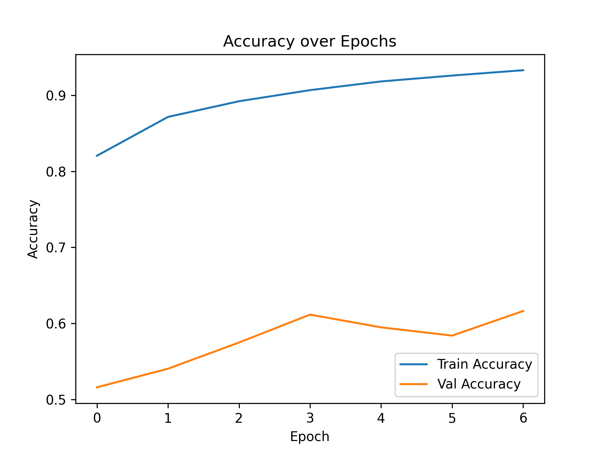
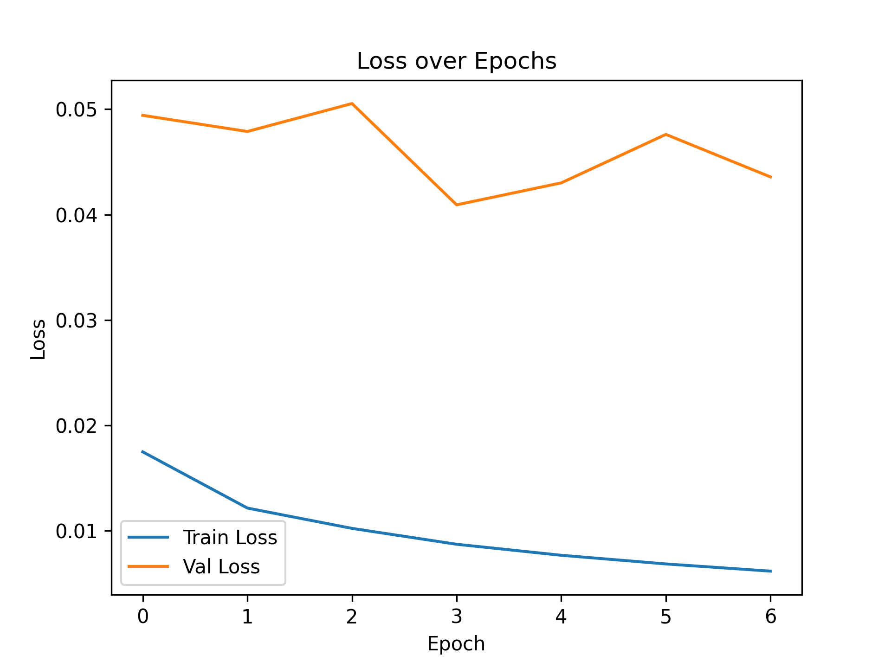
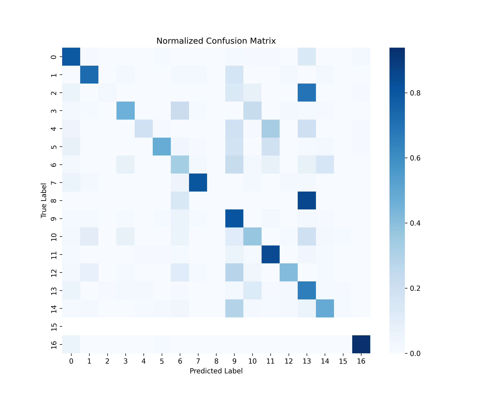
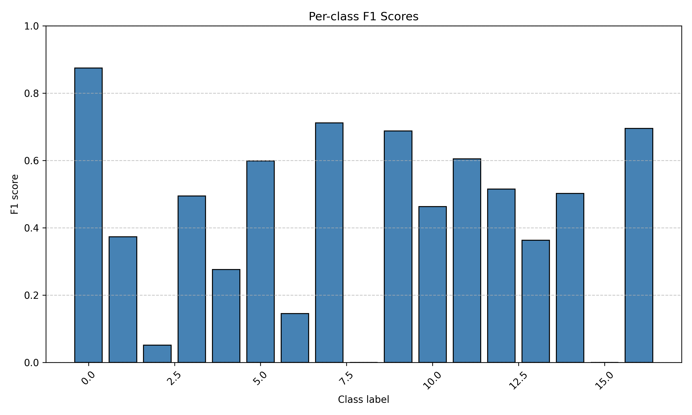

# Wildlife Image Classification (CCT20)

This project creates and uses an image classification pipeline on a subset of the Caltech Camera Traps (CCT20) dataset.  
A convolutional neural network (EfficientNet-B0) was trained in PyTorch to classify animal species from camera trap images.
The goal was to build and train a functional deep learning model on real-world imagery using limited compute resources, demonstrating the full work flow necessary from data preparation to model evaluation.

## Objective

Develop and evaluate an end-to-end image classification model capable of identifying wildlife species from camera trap images.  
The focus was on understanding the process and being able to set up image deep learning pipelines rather than achieving maximum accuracy.

## Technical Overview

**Component** : **Details** 
Dataset : Caltech Camera Traps (CCT20) – 260K images (subset used: ~20%)     
Model : EfficientNet-B0 (pretrained on ImageNet)   
Framework : PyTorch   
Image Size : 224 × 224   
Loss Function : CrossEntropyLoss   
Optimizer : Adam    
Split : 80/10/10 (StratifiedGroupKFold by location and label)  
Hardware : CPU-only training   
Epochs : 6   
Learning Rate : 1e-3    
   
## Results Summary

**Metric** : **Value**  
Validation Accuracy : ~61.6%   
Validation Loss : 0.043   
Best Epoch : 6   

Training and validation metrics indicate stable convergence with mild overfitting, expected given dataset imbalance and limited compute.

### Key Performance Figures

**Accuracy and Loss Curves**  
  

**Normalized Confusion Matrix**  

**Per-Class F1 Scores**  

## Repository Structure
├── src/ # Model, dataset, and training scripts  
├── notebooks/ # Jupyter notebooks for running of scripts and analysis  
├── reports/  
│ ├── figures/ # Output plots and visualizations  
│ ├── classification_report.csv  
│ └── performance_log.csv  
├── data  
└── README.md   

## How to Run

1. Install dependencies  
   pip install -r requirements.txt

2. Prepare dataset
Download the Caltech Camera Traps (CCT20) dataset and structure it as:

   data/cct/  
   ├── images/  
   └── annotations/  

3. Datapreprocessing, set up Dataloader and Datasets, then train models all:
   jupyter notebook notebooks/exploratory_notebook.ipynb

4. Metric Analysis:
   jupyter notebook notebooks/metrics.ipynb

## Discussion Summary

The model converged smoothly, with validation accuracy reaching about 61%.  
Training and validation losses remained close, indicating model was capable of learning without major overfitting.  
Performance was strongest on frequent or visually distinct classes, while minority classes performed poorly likely due to data imbalance.  

## Future Work

- Apply data augmentation and class-weighted loss
- Introduce learning-rate scheduling
- Train full dataset with GPU acceleration
- Investigate model calibration and deployment options

Author

[Ben Jones]
Molecular Bioengineering, Imperial College London
October 2025

Note: This project was created to demonstrate practical implementation of an image classification workflow on a real-world dataset.
